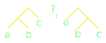

<!--
- title : Voyage au pays des Case-Classes, Algèbre abstraite pour dévelopeu.r.se concrèt.e .
- description :
- author : Christophe Calvès
- theme : league
- transition : convex
- slideNumber : true -->

<style type="text/css">
  .reveal li code { font-size:  70%;    }
</style>


# Voyage au pays des
# Case Class
### Algèbre abstraite pour dévelopeu.r.se concrèt.e

[Christophe Calvès](https://www.linkedin.com/pub/christophe-calv%C3%A8s/b0/325/ab6)/
[@chrilves](http://twitter.com/chrilves)

https://github.com/christophe-calves/psug-2016-7.git

---

# Lectures Conseillées

<a href="https://www.labri.fr/perso/casteran/CoqArt/"></a>
<a href="https://global.oup.com/academic/product/category-theory-9780199237180?cc=ru&lang=en&"></a>

---

# Soyons cohérents
### Ne fraudons pas!
- `null`
- les exceptions
- `asInstanceOf` / `isInstanceOf` (sauf sommes)
- effets de bord
- reflexion
- Récursion générale

---

# Case Class?

```scala
case class Voiture(model : String, portes : Int, couleur : String)
```

```scala
val voiture : Voiture = Voiture("206", 3, "Blanche")
```

```scala
def penture(v : Voiture, c : String) : Voiture = v match {
  case Voiture(model, portes, couleur) => Voiture(model, portes, c)
}
```

----

### Familles scélées

```scala
sealed abstract class Couleur
case object Carreaux extends Couleur
case object Coeur    extends Couleur
case object Pique    extends Couleur
case object Trefle   extends Couleur
```

```scala
def rouge(c : Couleur) : Boolean = c match {
  case Carreaux => true
  case Coeur    => true
  case Pique    => false
  case Trefle   => false
}
```

----

### Les Listes

```scala
sealed abstract class Liste[+A]
final case object Vide                                 extends Liste[Nothing]
final case class  Cons[+A](tete : A, reste : Liste[A]) extends Liste[A]
```

```scala
val vide         = Vide
val singleton    = Cons(1, Vide)
val deuxValeurs  = Cons(3, singleton)
val deuxValeurs2 = Cons(3, Cons(1, Vide))

assert(deuxValeurs == deuxValeurs2)
```

```scala
def taille[A](l : Liste[A]) : Int = l match {
  case Vide           => 0
  case Cons(_, reste) => 1 + taille(reste)
}
```

---

# Pitch

```scala
sealed abstract class ListeP[+A]
case object VideP                                  extends ListeP[Nothing]
case class  ConsP[+A](tete : A, reste : ListeP[A]) extends ListeP[A]

trait ListeI[+A] {
  def fold[R](vide : R)(cons : (A, R) => R) : R
}
```

```scala
type StreamP[+A] = scala.collection.immutable.Stream[A]

trait StreamI[+A] {
  def matcher[R](vide : R)(cons : (A, StreamI[A]) => R) : R
}
```

---

# Bijection


```
trait <=>[A,B] {
  def from(a : A) : B
  def to(b : B)   : A
}
```

```scala
"idA" -> forAll( (a:A) => to(from(a)) == a)
"idB" -> forAll( (b:B) => from(to(b)) == b)
```

```scala
def optionIsEither[A] : Option[A]   <=> Either[Unit, A]
def string            : List[Char]  <=> String
def const[A]          : (Unit => A) <=> A
```

----

### Produit
*model* **ET** *portes* **ET** *couleur*

```scala
final case class VoitureP(model : String, portes : Int, couleur : String)

trait VoitureI {
  def matcher[R](consomateur : (String, Int, String) => R) : R
}

def VoitureI(model : String, portes : Int, couleur : String) = new VoitureI {
    def matcher[R](f: (String, Int, String) => R): R = f(model, portes, couleur)
}
```

```scala
def f(model : String, portes : Int, couleur : String) : R

VoitureP("Corsa",3,"rouge") match {
  case VoitureP(m, p, c) => f(m,p,c)
}

VoitureI("Corsa", 3, "rouge").matcher {
  (m, p, c) => f(m,p,c)
}
```

----

### Somme
*Vrai* **OU** *Faux*
```scala
sealed abstract class BooleenP
case object VraiP extends BooleenP
case object FauxP extends BooleenP
```

```scala
trait BooleenI {
  def matcher[R](vrai : R, faux : R) : R
}

val VraiI = new BooleenI { def matcher[R](vrai: R, faux: R): R = vrai }
val FauxI = new BooleenI { def matcher[R](vrai: R, faux: R): R = faux }
```

```scala
(b : BooleenP) match {
  case VraiP => si_vrai
  case FauxP => si_faux
}

(b : BooleenI).matcher
  si_vrai,
  si_faux
}
```

----

### Types Recursifs

```scala
sealed abstract class TypeRecursifP
final case class SansFinP(valeur : TypeRecursifP) extends TypeRecursifP
```

```scala
trait TypeRecursifI {
  def fold[R](f : R => R) : R
}

def SansFinI(valeur : TypeRecursifI) = new TypeRecursifI {
  def fold[R](f : R => R) : R = valeur.fold(f)
}
```

---


# (Co-)Algèbre

----

### Une algèbre de rédaction

```scala
trait Document[A] {
  def vide                     : A
  def text(s : String)         : A
  def italique(doc : A)        : A
  def fusion(elememts : A*)    : A
  def lien(url : java.net.URL) : A
  def chapitre(titre : String) : A
  def tableDesMatieres         : A

  "block()"       -> Prop(                   fusion()  == vide                       )
  "block(a)"      -> forAll( (a:A)        => fusion(a) == a                          )
  "block(text..)" -> forAll( (a b:String) => fusion(text(a), text(b)) == text(a ++ b))
}
```

```scala
val documentHTML     : Document[HTML]
val documentMarkDown : Document[MarkDown]
val documentMarkDown : Document[LaTeX]
```

----

### Abstraction du format

```scala
def livre[A](implicit A: Document[A]): A = {
  import A._

  fusion(
    tableDesMatieres,
    chapitre("Premier Chapitre"),
    fusion(
      text("le texte du premier chapitre"),
      lien(new java.net.URL("http://example.com"))
    ),
    chapitre("Deuxieme Chapitre"),
    text("Texte du deuxième chapitre")
  )
}
```

```scala
val livreHTML     = livre[HTML]
val livreMarkDown = livre[MarkDown]
val livreLaTeX    = livre[LaTeX]
```

---

# Algèbre

```scala
trait AlgebrePSUG[A] {
  def zero                        : A
  def plus(gauche : A, droit : A) : A
}
```

est équivalent à

```scala
sealed abstract class OperationPSUG[+A]
case object Zero                            extends OperationPSUG[Nothing]
case class  Plus[+A](gauche : A, droit : A) extends OperationPSUG[A]

type AlgebrePSUG[A] = OperationPSUG[A] => A
```

----

### Équivalence

```scala
trait AlgebrePSUG[A] {
  def zero               : A
  def plus(g : A, d : A) : A
}

sealed abstract class OperationPSUG[+A]
case object Zero                            extends OperationPSUG[Nothing]
case class  Plus[+A](gauche : A, droit : A) extends OperationPSUG[A]
```

```scala
def traitVersFonction[A](t : AlgebrePSUG[A]       ) : OperationPSUG[A] => A =
  (opa : OperationPSUG[A]) => opa match {
    case Vide      => t.vide
    case Plus(g,d) => t.plus(g,d)
  }

def fonctionVersTrait[A](f : OperationPSUG[A] => A) : AlgebrePSUG[A]        =
  new AlgebrePSUG[A] {
    def vide              : A = f(Vide)
    def plus(g : A, d: A) : A = f(Plus(g,d))
  }
```

----

### Exemple: Unit

```scala
object UnitPSUG extends AlgebrePSUG[Unit] {
  def zero: Unit = ()
  def plus(gauche: Unit, droit: Unit): Unit = ()
}

zero == ()
plus( () , () ) == ()
```

```scala
def algebrePSUGUnit(op : OperationPSUG[Unit]) : Unit = op match {
  case Zero      => ()
  case Plus(g,d) => ()
}

algebrePSUGUnit(Zero) == ()
algebrePSUGUnit(Plus( (), () )) == ()
```

----

### Examples: Entiers

```scala
object IntPSUG extends AlgebrePSUG[Int] {
  def zero: Int = 0
  def plus(gauche: Int, droit: Int): Int = gauche + droit
}

zero == 0
plus( 37 , 82 ) == 119
```


```scala
def algebrePSUGInt(op : OperationPSUG[Int]) : Int = op match {
  case Zero      => 0
  case Plus(g,d) => g + d
}

algebrePSUGInt(Zero) == 0
algebrePSUGInt(Plus(37, 82)) == 119
```

----

### Example : Listes


```scala
class ListPSUG[A] extends AlgebrePSUG[List[A]] {
  def zero: List[A] = Nil
  def plus(gauche: List[A], droit: List[A]): List[A] = gauche ++ droit
}

zero == Nil
plus( List(1,2) , List(3,4) ) == List(1,2,3,4)
```

```scala
def algebrePSUGList[A](op : OperationPSUG[List[A]]) : List[A] = op match {
  case Zero      => Nil
  case Plus(g,d) => g ++ d
}

algebrePSUGList(Zero) == Nil
algebrePSUGList(Plus(List(1,2), List(3,4))) == List(1,2,3,4)
```

----

### Example : Fonctions

```scala
object FunPSUG extends AlgebrePSUG[Int => Int] {
  def zero : Int => Int = (x => x)
  def plus(g : Int => Int, d : Int => Int) : Int => Int = (x => d(g(x)))
}

zero == { x :Int => x }
plus( (x:Int)=>x+1 , (x:Int)=>x*3 ) == { x : Int => (x+1)*3 }
```

```scala
def algebrePSUGFun(op : OperationPSUG[Int => Int]) : Int => Int = op match {
  case Zero      => (x => x)
  case Plus(g,d) => (x => d(g(x)))
}

algebrePSUGFun(Zero) == { x : Int => x }
algebrePSUGFun(Plus( (x:Int)=>x+1 , (x:Int)=>x*3 )) == { x : Int => (x+1)*3 }
```

---


# Co-Algebre

```scala
trait CoAlgebre[A] extends (A => Operation[A]) {
  def apply(a : A) : Operation[A]
}
```

```scala
def decompose[A : CoAlgebre](a : A) : Operation[A]
```


----

### Decomposition en liste

```scala
abstract sealed class OperationListe[+I, +A]
case object Vide                             extends OperationListe[Nothing, Nothing]
case class  Cons[I , A](tete : I, reste : A) extends OperationListe[I,A]
```

```scala
trait CoAlgebreListe[I, A] extends (A => OperationListe[I, A]) {
  def apply(a : A) : OperationListe[I,A]
}
```

----

### Entiers => Liste de booleens

```scala
object decompose extends CoAlgebreListe[Boolean, Long] {
  def apply(a: Long): OperationListe[Boolean, Long] =
    if (a <= 0) Vide
    else Cons(a % 2 == 1, a / 2)
}
```

```scala
// 5 = 101
decompose(5) == Cons(true , 2)
decompose(2) == Cons(false, 1)
decompose(1) == Cons(true , 0)
decompose(0) == Vide
```

```scala
def puissance(n : Long, p : Long) : Long = decompose(p) match {
  case Vide           => 1
  case Cons(false, r) => puissance(n * n, r)
  case Cons(true , r) => puissance(n * n, r) * r
}
```

----


### Labyrinthe

```scala
sealed abstract  class Cas[+A]
case object Sortie                                        extends Cas[Nothing]
case object CulDeSac                                      extends Cas[Nothing]
case class  Bifurcation[+A](chemin0 : (String, A),
                            chemin1 : (String, A),
                            chemins : List[(String , A)]) extends Cas[A]
```

```scala
trait Labyrinthe[A] extends (A => Cas[A]) {
  def apply(a : A) : Cas[A]
}
```

```scala
def parcour[A](a : A)(implicit A : Labyrinthe[A]) : Unit = A(a) match {
    case Sortie                   => println("Gagné!")
    case CulDeSac                 => println("Perdu!")
    case Bifurcation(un, deux, l) =>
      val chemins = un :: deux :: l
      parcour(chemins(scala.io.StdIn.readInt())._2)
}
```

---

# Morphisme

----

### Algèbre de nombres

```scala
trait Num[A] extends (Op[A] => A) {
  def zero : A
  def un   : A
  def plus(x : A, y : A) : A
  def mult(x : A, y : A) : A
}
```

```scala
sealed abstract class Op[+A] {
   def map[B](f : A => B) : Op[B]
}
case object Zero               extends Op[Nothing]
case object Un                 extends Op[Nothing]
case class  Plus[+A](g:A, d:A) extends Op[A]
case class  Mult[+A](g:A, d:A) extends Op[A]
```

----

### Algèbre Num sur les entiers

```scala
object LongNum extends Num[Long] {
  def zero = 0
  def un   = 1
  def plus(gauche: Long, droite: Long): Long = gauche + droite
  def mult(gauche: Long, droite: Long): Long = gauche * droite
}
```

----

### Algèbre Num sur les listes

```scala
object ListNum extends Num[List[Any]] {
  def zero = Nil
  def un   = List("")
  def plus(gauche: List[Any], droite: List[Any]): List[Any] = gauche ++ droite
  def mult(gauche: List[Any], droite: List[Any]): List[Any] =
    for {
      g <- gauche
      d <- droite
    } yield (g,d)
}
```

```scala
plus(List(1,2,3), List('a','b')) == List(1,2,3,'a','b')

mult(List(1,2,3), List('a','b')) ==
  List( (1,'a'), (1,'b'),
        (2,'a'), (2,'b'),
        (3,'a'), (3,'b')
      )
```

----

### Polynomes

$$3  = 1 +  1 +  1$$
$$3X = X +  X +  X$$
$$X³ = X \* X \* X$$

- On peut calculer le polynome sur les valeurs de type `A`
$$P(X : A) = 4X⁹ + 8X³$$

 - `P(11) = 9 431 801 412`
 - `P(List(0,1,2,3,4,5,6,7,8,9,10))` = une liste de `9 431 801 412` elements.

----

### Correspondance


```scala
taille(Nil        ) == 0
taille(List("")   ) == 1
taille(l1 ++ l2   ) == taille(l1) + taille(l2)
taille(mult(l1,l2)) == taille(l1) * taille(l2)
```


----

### Preservation

```scala
val algList : Op[List] => List = ListNum
val algLong : Op[Long] => Long = LongNum

val oplist : Op[List] = Plus(List(1,2,3) , List('a','b'))

// Sur les listes
val x = algList(oplist)
      = List(1,2,3) ++ List('a','b') = List(1,2,3,'a','b')

taille( x ) == 5

// Sur les entiers
val y = oplist.map(taille)
      = Plus(taille(List(1,2,3)) , taille(List('a','b')) == Plus(3, 2)

algLong( y ) == 3 + 2 == 5
```

```scala
forAll{ (oplist : Op[List]) =>
  taille( algList(oplist) : List ) == algLong( oplist.map(taille) : Op[Long])
}
```

----

### Comme ...

```scala
val oplist : Op[List] = Plus(List(1,2,3) , List('a','b'))
```


----

### ... Alors!

```scala
def f[A : Num](a : A) : A // En supposant que 'f' logiquement fondée!
```


----

### Morphisme de co-algèbre

```scala
def coAlgA(a : A) : Op[A] // Co-Algèbre `Op` sur A
def coAlgB(b : B) : Op[B] // Co-Algèbre `Op` sur A

def fAB(a : A) : B        // Une fonction de A vers B
```


----

### IsoMorphisme d'Algebre


```scala
def algA(a : Op[A]) : A // Algèbre `Op` sur A
def algB(b : Op[B]) : B // Algèbre `Op` sur A
def bijAB : A <=> B // Une bijection entre A et B

def f[A](a:A) : A
```


----

### En résumé

- *Morphisme*
 - **Structure** d'une (co-)algèbre `A` est **contenue** dans une (co-algèbre) `B`
 - **Préserve** les opérations/égalités d'une (co-)algèbre `A` vers une (co-algèbre) `B`.
- *IsoMorphisme*
 - Deux **structures** de (co-algèbres) sont **équivalentes**.
 - Tout ce qui se fait dans l'une, se fait **identiquement** dans l'autre.

---

# Structures Initiales/Finales

----

### Construire la (co-)alèbre la plus générale.

Opérations
```scala
sealed abstract class OperationPSUG[+A]
case object Zero                            extends OperationPSUG[Nothing]
case class  Plus[+A](gauche : A, droit : A) extends OperationPSUG[A]
```

Algèbre
```scala
trait AlgebrePSUG[A] extends (OperationPSUG[A] => A) {
  def zero           : A = this(Zero)
  def plus(g:A, d:A) : A = this(Plus(g, d))
}
```

Co-Algèbre
```scala
trait CoAlgebrePSUG[A] extends (A => OperationPSUG[A]) {
  def apply(a : A) : OperationPSUG[A]
}
```

----

### Algèbre la plus générale

```scala
trait AlgebrePSUG[A] {
  def zero           : A
  def plus(g:A, d:A) : A
}
```
- `InitialPSUG` ne contient que le **nécessaire** pour être une `AlgebrePSUG`!
 - Plus **petit** ensemble **construit** à partir de `Zero` et `Plus`
 - Plus **petit point fixe** de `OperationPSUG`
   - `InitialPSUG = OperationPSUG[InitialPSUG]`
   - Les **combinaisons finies** de `Zero` et `Plus`
- Toute algèbre `AlgebrePSUG` contient la structure de `InitialPSUG`
 - **Unique morphisme de** `InitialPSUG` **vers** chaque `AlgebrePSUG`

----

### Algèbre la plus générale

Combinaisons finies de `Zero` et `Plus`
```scala
abstract sealed class InitialPSUG
case object Zero                                            extends InitialPSUG // Vide
case class  Plus(gauche : InitialPSUG, droit : InitialPSUG) extends InitialPSUG // Noeud

type InitialPSUG = OperationPSUG[InitialPSUG]
```

Principe de récurence

```scala
trait InitialPSUG {
   def fold[A : AlgebrePSUG] : A
// def fold[A](zero : A)(plus : (A,A) => A) : A
}

def uniqueMorphisme[A : AlgebrePSUG](i : InitialPSUG) : A = i.fold[A]

def uniqueMorphisme[A](zero : A)(plus : (A,A) => A) : InitialPSUG => A
```

----

### Co-Algèbre la plus générale

```scala
sealed abstract class OperationPSUG[+A]
case object Zero                            extends OperationPSUG[Nothing]
case class  Plus[+A](gauche : A, droit : A) extends OperationPSUG[A]
```

```scala
trait CoAlgebrePSUG[A] extends (A => OperationPSUG[A]) {
  def apply(a : A) : OperationPSUG[A]
}
```

- `FinalCoPSUG` ne contient que les deconstructions **nécessaire**!
  - Les combinaisons finies et **infinies** de `Zero` et `Plus`
- Toute co-algèbre `AlgebrePSUG` contient la structure de `FinalCoPSUG`
 - **Unique morphisme depuis** chaque `AlgebrePSUG` vers `FinalCoPSUG`

----

### Co-Algèbre la plus générale


```scala
trait FinalCoPSUG {
  def matcher : OperationPSUG[FinalCoPSUG]
}

def uniqueMorphisme[A : CoAlgebrePSUG](a : A) : FinalCoPSUG

def uniqueMorphisme[A](ana : A => OperationPSUG[A]) : A => FinalCoPSUG
```

Combinaisons finies
```scala
val ZeroI                               = new FinalCoPSUG { def matcher = Zero }
def PlusI(g:FinalCoPSUG, d:FinalCoPSUG) = new FinalCoPSUG { def matcher = Plus(g,d) }
```

et infinies
```scala
def infini : FinalCoPSUG = new FinalCoPSUG {
  def matcher = Plus(infini, infini)
}
```


---


# Liberté

- **But**:
 - Pour un type `T` (exemple: `T = Char`).
 - Dotter `T` d'une structure de `(Co)AlgebrePSUG`
- **Comment**:
 - En trouvant la `(Co)AlgebrePSUG` "la plus générale" **contenant** `T`.
 - Nouvelle opération `Elem(t : T):OperationPSUG[Nothing]`

----

### Ajout

Pour un type `T` donné.

```scala
sealed abstract class OperationLibrePSUG[+A]
case object Zero                            extends OperationLibrePSUG[Nothing]
case class  Plus[+A](gauche : A, droit : A) extends OperationLibrePSUG[A]
case class  Elem(t  : T)                    extends OperationLibrePSUG[Nothing]
```

```scala
trait AlgebreLibrePSUG[A] extends (OperationLibrePSUG[A] => A) {
 def zero           : A
 def plus(g:A, d:A) : A
 def elem(t : T)    : A
}
```

```scala
trait CoAlgebreLibrePSUG[A] extends (A => OperationLibrePSUG[A]) {
 def apply(a : A) : OperationLibrePSUG[A]
}
```

----

### Résultat

Pour un type `T` donné.

```scala
abstract sealed class LibrePSUG
case object Zero                               extends LibrePSUG // Vide
case class  Plus(g : LibrePSUG, d : LibrePSUG) extends LibrePSUG // Noeud(gauche, droit)
case class  Elem(t : T)                        extends LibrePSUG // Feuille(t)
```

```scala
trait LibrePSUG {
   def fold[A : AlgebreLibrePSUG] : A
// def fold[A](zero : A)(plus : (A,A) => A)(elem : T => A) : A
// def fold[A : AlgebrePSUG](elem : T => A) : A
}
```

```scala
trait CoLibrePSUG {
  def matcher : OperationLibrePSUG[CoLibrePSUG] // Vide ou Noeud ou Feuille
}
```

---

# Lois

```scala
trait Monoid[A] extends AlgebrePSUG[A]{
  def zero : A
  def plus(g:A, d:A) : A

  def lois = new SimpleRuleSet("monoid",
    "0 + a = a" -> forAll( (a:A) => plus(zero, a) == a),
    "a + 0 = a" -> forAll( (a:A) => plus(a, zero) == a),
    "(a+b)+c = a+(b+c)" ->
      forAll( (a:A,b:A,c:A) => plus(plus(a, b), c) == plus(a, plus(b,c))) )
}
```

----

### Faux!

```scala
abstract sealed class LibrePSUG
case object Zero                               extends LibrePSUG // Vide
case class  Plus(g : LibrePSUG, d : LibrePSUG) extends LibrePSUG // Noeud(gauche, droit)
case class  Elem(t : T)                        extends LibrePSUG // Feuille(t)
```

```scala
"(a+b)+c = a+(b+c)" ->
  forAll( (a:A,b:A,c:A) => plus(plus(a, b), c) == plus(a, plus(b,c))) )
```



----

### Normalisation

````scala
"0+a     = a"      ->forAll((a:A) => plus(zero, a) == a )
"a+0     = a"      ->forAll((a:A) => plus(a, zero) == a )
"(a+b)+c = a+(b+c)"->forAll((a:A,b:A,c:A) => plus(plus(a, b), c) == plus(a, plus(b,c)))
```

```scala
def simplifier(x : LibrePSUG) : LibrePSUG = x match {
  case Plus(Zero, a)      => a
  case Plus(a, Zero)      => a
  case Plus(Plus(a,b), c) => Plus(a, Plus(b,c))
  case _                  => x
}
```

Formes normales:
- `Zero`
- `Plus(Elem(t1), Plus(Elem(t2), ... Plus(Elem(tn), Elem(tn+1))))`

----

### Formes Normales

```scala
sealed abstract class MonoidLibre
case object Zero                                    extends MonoidLibre
case class  PlusEnum(tete : T, reste : MonoidLibre) extends MonoidLibre
```

- Uniquement le nécessaire (`Zero` et `Plus`)
- Respecte toutes les lois.
- Unique morphisme d'algèbre vers chaque monoid.

```scala
def uniqueMorphisme[A : Monoid](elem : T => A) : MonoidLibre => A
```

----

### Liste

- `List[T]`
 - `Moinoid` libre sur le type `T`
 - algèbre la plus générale de `AlgebreListeT`

```scala
trait AlgebreListeT[+A] {
  def vide                    : A
  def cons(hd : T, reste : A) : A
}
```

IsoMorphisme

```scala
sealed abstract class MonoidLibre
case object Zero                                    extends MonoidLibre
case class  PlusEnum(tete : T, reste : MonoidLibre) extends MonoidLibre
```

```scala
trait MonoidLibre {
   def fold[A : AlgebreListeT] : A
// def fold[A](vide : A)(cons : (T, A) => A) : A
}
```

----

### Lois : Co-Algèbre

```scala
trait CoAlgebreMonoid[A] extends CoAlgebrePSUG[A] {
  def apply(a : A) : OperationPSUG[A]

  // Pour n'importe quelle décomposition de `x:A`
  Plus(Zero, a) == a
  Plus(a, Zero) == a
  Plus(Plus(a, b), c) == Plus(a, Plus(b,c)))
}
```

Formes normales
```scala
sealed abstract class OperationCoAlgebreMonoid[+A]
case object Zero                             extends OperationCoAlgebreMonoid[Nothing]
case class  PlusElem[+A](tete: T, reste : A) extends OperationCoAlgebreMonoid[A]

trait CoAlgebreMonoid[A] extends (A => OperationCoAlgebreMonoid[A]) {
  def apply(a : A) : OperationCoAlgebreMonoid[A]
}
```

----

### Stream


- `Stream[T]`
 - Co-algèbre `Monoid` co-libre sur le type `T`
 - Co-algèbre la plus générale de `CoAlgebreListeT`

```scala
trait CoAlgebreListeT[+A] extends (A => OperationListeT[A]) {
  def apply(a : A) : OperationListeT[A]
}

sealed abstract class OperationListeT[+A]
case object Vide                     extends OperationListeT[Nothing]
case class  Cons(tete: T, reste : A) extends OperationListeT[A]
```

```scala
trait Stream {
   def matcher : OperationListeT[Stream]
// def matcher[B](vide : B)(cons : (T, Stream) =>  B) : B
}
```

---

# Application

----

### Une monade

```scala
trait Monad[M[_]] {
  def point[B]     :  B                 => M[B]
  def flatMap[A,B] : (M[A] , A => M[B]) => M[B] //= (e, f) =>flatten(map(e,f))

  point(a).flatMap(f)     == f(a)
  e.flatMap(point)        == e
  e.flatMap(f).flatMap(g) == e.flatMap(x => f(x).flatMap(g))
}
```

ou

```scala
trait Monad[M[_]] {
  def point[B]     :  B                 => M[B]
  def flatten[B]   :  M[M[B]]           => M[B] //=  e    => flatMap(e, y => y)
  def map[A,B]     : (M[A] , A =>   B ) => M[B] //= (e,f) => flatMap(e, y => point(f(y)))

  e.map(x => x)           == e
  e.map(f).map(g)         == e.map(x => g(f(x))

  e.flatten.flatten       == e.map(_.flatten).flatten
  e.map(point).flatten    == point(e).flatten == e
  e.map(_.map(f)).flatten == e.flatten.map(f)
}
```

----

### Monade Sur F[_]

```scala
type F[X] = (X, X)
```

```scala
trait MonadSurF[M[_]] {
  def point[B]     :  B                 => M[B]
  def elem[B]      :  F[B]              => M[B]

  def flatMap[A,B] : (M[A] , A => M[B]) => M[B]
}
```
ou

```scala
trait MonadSurF[M[_]] {
  def point[B]     :  B                 => M[B]
  def elem[B]      :  F[B]              => M[B]

  def flatten[B]   :  M[M[B]]           => M[B]
  def map[A,B]     : (M[A] , A =>   B ) => M[B]
}  
```

---

### Monade Libre

$$e.flatMap(f) = e.map(f).flatten$$

```scala
trait MonadSurF[M[_]] {
  def point[B]     :  B                 => M[B]
  def flatten[B]   :  M[M[B]]           => M[B]
  def map[A,B]     : (M[A] , A =>   B ) => M[B]
  def elem[B]      :  F[B]              => M[B]
}
```

```scala
sealed abstract class MonadLibre[B]
case class Point[B](  b : B                          ) extends MonadLibre[B]
case class Elem[B](   b : F[B]                       ) extends MonadLibre[B]
case class Flatten[B](e : MonadLibre[MonadLibre[B]]  ) extends MonadLibre[B]
case class Map[A,B](  e : MonadLibre[A], f : A =>   B) extends MonadLibre[B]
```

----

### Éliminons Map

Si `F` a **déjà** un `map`:

```scala
sealed abstract class MonadLibre[B]
case class Point[B](  b : B                        ) extends MonadLibre[M,B]
case class Elem[B](   b : F[B]                     ) extends MonadLibre[M,B]
case class Flatten[B](e : MonadLibre[MonadLibre[B]]) extends MonadLibre[M,B]
```

```scala
def map[A,B](ma : MonadLibre[A])(f : A => B) : MonadLibre[B] = ma match {
  case Point(a : A)    => Point(f(a) : B)
  case Elem(fa : F[A]) => Elem(fa.map(f) : F[B])
  case Flatten(e : MonadLibre[MonadLibre[A]]) =>
    // e.map(_.map(f)).flatten == e.flatten.map(f)
    Flatten( e.map(_.map(f) ) )
}
```

*Toutes* les équations sont elles *respectées*?


----

### Formes normales

```scala
Flatten(Flatten(e)) => Flatten(e.map(Flatten))
Flatten(Point(b))   => b
```

```scala
sealed abstract class MonadLibre[B]
case class Point[B]      (b : B               ) extends MonadLibre[M,B]
case class FlattenElem[B](e : F[MonadLibre[B]]) extends MonadLibre[M,B]
```

```scala
trait Poly[F[_], M[_]] {
  def apply[A](fa : F[A]) : M[A]
}

// Avec `F` déjà un foncteur !!
def uniqueMorphisme[M[_] : MonadSurF, A](ml : MonadLibre[A])                    : M[A]
def uniqueMorphisme[M[_] : Monad    , A](ml : MonadLibre[A])(elem : Poly[F, M]) : M[A]
```

---

### Monade encore plus libre

Monad sur le type `F[_]`
```scala
type F[X] = (X, X)
```

```scala
trait MonadSurF[M[_]] {
  def point[B]     :  B                 => M[B]
  def elem[B]      :  F[B]              => M[B]
  def flatMap[A,B] : (M[A] , A => M[B]) => M[B]
}
```

```scala
sealed abstract class MonadLibre[B]
case class Point[B](b : B   )                                      extends MonadLibre[B]
case class Elem[B](fb : F[B])                                      extends MonadLibre[B]
case class FlatMap[A,B](e : MonadLibre[A], f : A => MonadLibre[B]) extends MonadLibre[B]
```

----

### Normaliation

```scala
FlatMap(Point(a), f)      => f(a)
FlatMap(FlatMap(e, f), g) => FlatMap(e, x => FlatMap(f(x), g))
```

```scala
sealed abstract class MonadLibre[B]
case class Point[B](b : B)                                extends MonadLibre[B]
case class FlatMap[A,B](e : F[A], f : A => MonadLibre[B]) extends MonadLibre[B]
```

```scala
// Aucune contrainte sur `F`
def uniqueMorphisme[M[_] : MonadSurF, A](ml : MonadLibre[A])                    : M[A]
def uniqueMorphisme[M[_] : Monad    , A](ml : MonadLibre[A])(elem : Poly[F, M]) : M[A]
```

---

# Conclusion

- *Spécification*
  - **Opérations** de vôtre domaine?
  - **Lois** à garantir?
- *Réalisation*
  - Représentation par des (Co-)Algébres **initiales/finales**, (Co-)Libres
  - Garantir les lois en trouvant les **formes normales**
- *Cadeau Bonus*
  - **Morphisme** vers/depuis n'importe quelle instance.

---

# Annexes

---

## Algebre
# VS
## Sous-Typage


----

### Quantification

Algèbre

```scala
trait Plus[A] {
  def plus(l : A, r : A) : A
}
```

Sous typage


```scala
trait Plus {
  def plus(r : Plus) : Plus
}

final case class IntPlus(value : Int) extends Plus {
  def plus(r : Plus) : Plus = ???
}

final case class ListPlus(value : List[String]) extends Plus {
  def plus(r : Plus) : Plus = ???
}

```

----

### F-Bounded

```scala
trait PlusF[A <: PlusF[A]] {
  def plus(r : A) : A
}

final case class IntPlusF(value : Int) extends PlusF[IntPlusF] {
  def plus(r : IntPlusF) : IntPlusF = IntPlusF(value + r.value)
}

def doubleF[A <: PlusF[A]](a : A) : A = a.plus(a)
```

Constantes?

---

## Fold = Principe d'induction

Algèbre
```scala
trait AlgebreNat[A] {
  def zero         : A
  def plus1(a : a) : A
}
```

Structure initiale
```scala
sealed abstract class Nat {
  def fold[A : AlgebreNat]              : A
  def fold[A](zero : A, plus1 : A => A) : A
}
case object Zero           extends Nat
case class  Plus1(n : Nat) extends Nat
```

Principe d'induction
```scala
def uniqueMorphisme[A : AlgebreNat]              : Nat => A
def uniqueMorphisme[A](zero : A, plus1 : A => A) : Nat => A
```
