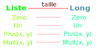
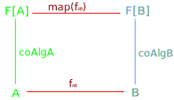

<!--
- title : Modéliser astucieusement vos données: des énumérations aux algèbres libres
- description :
- author : Christophe Calvès
- theme : league
- transition : convex
- slideNumber : true -->

<style type="text/css">
  .reveal li code { font-size:  100%; width : 600pt; }
</style>


# Modéliser *astucieusement*
# vos données
### des énumérations aux algèbres libres

*Christophe Calvès* [@chrilves](http://twitter.com/chrilves) / [MFG Labs](http://mfglabs.com)
https://github.com/chrilves/f-algebra-talk.git

----

## Pourquoi s'y intéresser!

```scala
final case class Either[A,B](left : Option[A], right : Option[B])
```

- Les *types* de données sont le **reflet** du *domaine métier*
- **Tout** le code **en dépend**
- Une modélisation **incorrecte**
 - est la porte ouverte aux **bugs**
 - **obscurcit** la logique du code
- Une modélisation **fidèle** expose l'**intention**, la **logique métier**

```scala
scala> val x = Either[Int, String](None, None)
x: Either[Int,String] = Either(None,None)
```

----

# Libéré·e, Délivré·e

- Nous ne sommes **pas limités·e·s** aux classiques : *strings*, *nombres*, *octets*, *listes*, ...
- **Tout** est **possible**, du moment que c'est **cohérent**
- Nous avons toute la **créativité**, la **liberté** et la **puissance** des *maths* pour modéliser *correctement* nos données.


---

## *Qu'est ce* qu'une Présentation?

- Du **texte** : bla bla bla
- Des **images**


- Du **code**
```scala
final abstract class InstantiateThisIfYouCan {
    def apply[A] : A 
}
```
- Des listes à **puces**
 - de la **concaténation**
 - des **grilles**


----

## *Qu'est-ce* qu'une Présentation?

- Une *valeur* `p` d'un *type*/*ensemble*/*espace* `P`
- des opérations de **base**
```scala
def vide : P
def texte(s : String) : P
def image(f: File) : P
def code(lecode : String) : P
```
- Des **compositions**
```scala
def concat(p1 : P, p2 : P) : P
def puces(ps : List[P]) : P
def grille(mat : List[List[P]]) : P
```
- Des **lois** à respecter
```scala
concat(vide, p)          == p == concat(p, vide)
concat(a, concat(b, c))  == concat(concat(a,b), c)
concat(text(a), text(b)) == text(a + b)
```


----

### Algèbre de Présentation

```scala
trait Presentation[P] {
  def vide                        : P
  def concat(p1 : P, p2 : P)      : P

  def texte(s : String)           : P    
  def image(f: File)              : P
  def code(lecode: String)        : P

  def puces(ps : List[P])         : P
  def grille(mat : List[List[P]]) : P

  // concat(vide, p)          == p == concat(p, vide)
  // concat(a, concat(b, c))  == concat(concat(a,b), c)
  // concat(text(a), text(b)) == text(a + b)
}
```

---

# Exemples d'Algèbres

```scala
trait Monoid[P] {
  def vide                   : P
  def concat(p1 : P, p2 : P) : P

  // concat(vide, p)         == p == concat(p, vide)
  // concat(a, concat(b, c)) == concat(concat(a,b), c)
}
```

```scala
trait Monad[P[_]] {
  def pure[A](a : A)                        : P[A]
  def flatMap[X,A](p : P[X], f : X => P[A]) : P[A]

  // flatMap(pure(a), f)      == f(a)
  // flatMap(pa, pure)        == pa
  // flatMap(flatMap(p,f), g) == flatMap(p, x => flatMap(f(x), g)) 
}
```

----

# Bijection

```
trait (A <-> B) {
  def from(a : A) : B  // to(from(a)) == a
  def to(b : B)   : A  // from(to(b)) == b
}
```
    
`A` et `B` sont **"équivalents"**

```scala
def optionIsEither[A] : Option[A]   <-> Either[Unit, A]

def string            : List[Char]  <-> String

def const[A]          : Unit => A   <-> A

def curry[A,B,C]      : A => B => C <-> (A,B) => C
```

----

# Équivalences

```scala
trait Monoid[P] {
  def vide                   : P
  def concat(p1 : P, p2 : P) : P
}
```
```scala
trait Monoid[P] {
  def vide(x : Unit)      : P // Unit => P    <-> P
  def concat(p1 : (P, P)) : P // P => P => P  <-> (P,P) => P
}
```
```scala
trait Monoid[P] {
  def f( Either[Unit, (P,P)] )     : P
  
  final def vide                   : P = f(Left(()))
  final def concat(p1 : P, p2 : P) : P = f(Right((p1, p2)))
}
```
```scala
type Monoid[P] = Either[Unit, (P,P)] => P
```

----

# Opérations

```scala
trait Monoid[P] {
  def vide                   : P
  def concat(p1 : P, p2 : P) : P
}
type Monoid[P] = Either[Unit, (P,P)] => P
```
sont surtout équivalents à
```scala
sealed abstract class MonoidF[+P]
case object Vide                       extends MonoidF[Nothing]
case class  Concat[+P](p1 : P, p2 : P) extends MonoidF[P]

type Monoid[P] = MonoidF[P] => P // MonoidF[P] <-> Either[Vide, Concat[P]]
```

----

## Foncteur

```scala
sealed abstract class MonoidF[+P]
case object Vide                       extends MonoidF[Nothing]
case class  Concat[+P](p1 : P, p2 : P) extends MonoidF[P]

new Functor[MonoidF] {
  def map[A,B](f : A => B) : MonoidF[A] => MonoidF[B] = {
    case Vide        => Vide
    case Concat(x,y) => Concat(f(x), f(y)) 
}}
```
- `MonoidF`-(Co)Algèbres
 
```scala
type MonoidF_Algebre[P]   = MonoidF[P] =>    P
type MonoidF_CoAlgebre[P] =    P       => MonoidF[P]
```
```
trait MonoidF_Algebre[A] {
 def vide                   : P  // Unit  => P
 def concat(p1 : P, p2 : P) : P  // (P,P) => P

trait MonoidF_CoAlgebre[P] {
  def decompose : MonoidF[P] // <-> Either[Unit, (P,P)]
}
```

----

## Algèbre de Présentation

```scala
trait Presentation[P] {
  def vide                        : P
  def concat(p1 : P, p2 : P)      : P

  def texte(s : String)           : P    
  def image(f: File)              : P
  def code(lecode: String)        : P

  def puces(ps : List[P])         : P
  def grille(mat : List[List[P]]) : P

  // concat(vide, p)          == p == concat(p, vide)
  // concat(a, concat(b, c))  == concat(concat(a,b), c)
  // concat(text(a), text(b)) == text(a + b)
}
```

----

# Presentation-F

```scala
sealed abstract class PresentationF[+P]
case object Vide                            extends PresentationF[Nothing]
case class  Concat[+P](p1 : P, p2 : P)      extends PresentationF[P]

case class  Texte(s : String)               extends PresentationF[Nothing]
case class  Image(f: File)                  extends PresentationF[Nothing]
case class  Code(lecode: String)            extends PresentationF[Nothing]

case class  Puces[+P](ps : List[P])         extends PresentationF[P]
case class  Grille[+P](mat : List[List[P]]) extends PresentationF[P]

val presentationF : Functor[PresentationF] = ...
```

```scala
type PresentationF_Algebre[P]   = PresentationF[P] =>       P
type PresentationF_CoAlgebre[P] =       P          => PresentationF[P]
```

----

### Équation de point fixe

```scala
type PresentationF_Algebre[P]   = PresentationF[P] =>       P
type PresentationF_CoAlgebre[P] =       P          => PresentationF[P]
```

Une équation
```scala
P <-> F[P]
```
les solutions sont naturellement des algèbres *et* coalgèbres
```scala
P <-> F[P] <-> F[F[P]] <-> F[F[F[P]]] <-> F[F[F[F[P]]]] <-> ...
```

deux en particulier

```scala
//   Fix[F] = P, case class P(unfold : F[P])
final case class Fix[F[_]](unfold: F[ Fix[F] ]) 

// CoFix[F] = P, trait P { def unfold: F[P] }
trait CoFix[F[_]] {
  def unfold : F[ CoFix[F] ]
}
```

----

# Application
`PresentationF`-Algèbre
```scala
// Pres <-> Fix[PresentationF]
sealed abstract class Pres
case object Vide                           extends Pres
case class  Concat(p1 : Pres, p2 : Pres)   extends Pres

case class  Texte(s : String)              extends Pres
case class  Image(f: File)                 extends Pres
case class  Code(lecode: String)           extends Pres

case class  Puces(ps : List[Pres])         extends Pres
case class  Grille(mat : List[List[Pres]]) extends Pres
```
`PresentationF`-CoAlgèbre
```scala
trait CoPres { // <-> CoFix[PresentationF]
  def unfold : PresentationF[CoPres]
}
```

---

# Générateurs

- On a un type `G` et un foncteur `F`

```scala
trait G { ... }
trait F[+_] { ... }
val functorF : Functor[F]
```

- Quels sont les `F`-(Co)Algèbre "contenant" `G`
- On cherche les types `P` tels que (avec les mains)
 - `G <: P`
 - `P` est une `F`-Algèbre

```scala
trait P { ... }
type E[+X] = Either[F[X], G]
val pEAlgebre     : E[P] => P
val pECoAlgebre   :  P   => E[P]

val pFAlgebre     : F[P] => P  = pEAlgebre(Left(_)) 
val gContenuDansP :  G   => P  = pEAlgebre(Right(_))
```

----

## Application : Monoïde
```scala
sealed abstract class MonoidE[+G, +P]
case object Vide                     extends MonoidE[Nothing, Nothing]
case class  Concat[+P](p1: P, p2: P) extends MonoidE[Nothing, P]

case class  Generateur[+G](g : G)    extends MonoidE[G, Nothing]
```

`Fix[MonoidE[G, ?]]` = arbres binaires sur `G`
```scala
// MonoidL[G] <-> Fix[MonoidE[G, ?]]
sealed abstract class MonoidL[+G]

case object Vide                       extends MonoidL[Nothing]
case class  Concat[+G](p1: MonoidL[G],
                       p2: MonoidL[G]) extends MonoidL[G]
                       
case class  Generateur[+G](g : G)      extends MonoidL[G]
```

----

# Est-ce un monoïde ?

```scala
new Monoid[ MonoidL[Int] ] {
 def vide                                       = Vide
 def concat(p1: MonoidL[Int], p2: MonoidL[Int]) = Concat(p1,p2)
 // concat(vide, p)         == p == concat(p, vide)
 // concat(a, concat(b, c)) == concat(concat(a,b), c)
}
```

`MonoidL[G]` est il un *monoide* ?

```scala
scala> Concat(Vide, Generateur(5)) == Generateur(5)
res0: Boolean = false
```
**NON**

----

# Lois

```scala
// concat(vide, p)         == p == concat(p, vide)
// concat(a, concat(b, c)) == concat(concat(a,b), c)
```
```scala
// MonoidL[G] <-> Fix[MonoidE[G, ?]]
sealed abstract class MonoidL[+G]
case object Vide                       extends MonoidL[Nothing]
case class  Concat[+G](p1: MonoidL[G],
                       p2: MonoidL[G]) extends MonoidL[G]
case class  Generateur[+G](g: G)       extends MonoidL[G]
```


----

# Normalisation

> Ne plus tolérer deux **valeurs différentes** pour ce qui devrait être **égal** selon les **lois**.

- Pour un foncteur `F`, partir de `Fix[F]`
- Écrire une fonction de simplification telle que :
 - Si `a` et `b` sont deux expressions qui doivent être égales selon les **lois**
 - alors en `Scala`, ` simplifier(a) == simplifier(b)`

----

### Exemple : MonoidL[G]

```scala
// Concat(Vide, p)         == p == Concat(p, Vide)
// Concat(a, Concat(b, c)) == Concat(Concat(a,b), c)
```

```scala
def simplifier[G](x : MonoidL[G]) : MonoidL[G] = x match {
  case Concat(Vide, a)        => a
  case Concat(a, Vide)        => a
  case Concat(Concat(a,b), c) => Concat(a, Concat(b,c))
  case _                      => x
}
```

En appliquant `simplifier` à tous les noeuds, il ne reste que :
```scala
Vide
```
```scala
Concat(Generateur(t1),
       Concat(Generateur(t2),
              ...,
                 Concat(Generateur(tn),
                        Generateur(tn+1)
                       )
             )
      )
```

----

### Résultat

```scala
sealed abstract class MonoidE[+G, +P]
case object Vide                           extends MonoidE[Nothing, Nothing]
case class  ConcatGen[+G,+P](hd: G, tl: P) extends MonoidE[G,P]
```
Respectent les lois par construction :
```scala
type   List[+G] =   Fix[MonoidE[+G, ?]]
type Stream[+G] = CoFix[MonoidE[+G, ?]]
```

```scala
sealed abstract class List[+G]
case object Vide                              extends List[Nothing]
case class  ConcatGen[+G](hd: G, tl: List[G]) extends List[G]

trait Stream[+G] {
  def unfold : MonoidE[+G, Stream[G]] 
}
```

---

# Morphismes

### `NumF`-Algèbres

```scala
sealed abstract class NumF[+A]
case object Zero                 extends NumF[Nothing]
case object Un                   extends NumF[Nothing]
case class  Plus[+A](g: A, d: A) extends NumF[A]
case class  Mult[+A](g: A, d: A) extends NumF[A]

val functorNumF : Functor[NumF] = ...
```

```scala
type NumF_Algebre[+A]   = NumF[A] =>   A
type NumF_CoAlgebre[+A] =   A     => NumF[A]
```

----

### `NumF`-Algèbre sur les entiers

```scala
def numFLong(nl: NumF[Long]) : Long = nl match {
  case Zero       => 0
  case Un         => 1
  case Plus(g, d) => g + d
  case Mult(g, d) => g * d
}
```

```scala
val numFLong: NumF_Algebre[Long] = NumFLong _
```

----

### `NumF`-Algèbre  sur les listes

```scala
def numFListe(ln: NumF[List[Any]]) : List[Any] = ln match {
  case Zero       => Nil
  case Un         => List(42)
  case Plus(g, d) => g ++ d
  case Mult(g, d) => for {a <- g; b <- d} yield (a,b)
}
```

```scala
Plus(List(1,2,3), List('a','b')) -> List(1,2,3,'a','b')

Mult(List(1,2,3), List('a','b')) ->
  List( (1,'a'), (1,'b'),
        (2,'a'), (2,'b'),
        (3,'a'), (3,'b')
      )
```

```scala
val numFListe: NumF_CoAlgbre[List[Any]] = NumFListe _
```

----

### Polynômes

- Entiers naturels  
 $$3  = (1 +  1) +  1$$
- Addition
 $$3X = (X +  X) +  X$$
- Puissances
 $$X³ = (X \* X) \* X$$

- On peut calculer le polynôme sur les valeurs de type `A`
$$P(X : A) = 4X⁹ + 8X³$$

 - `P(11) = 9 431 801 412`
 - `P(List(0,1,2,3,4,5,6,7,8,9,10))` = une liste de `9431801412` elements.

----

### Correspondance


```scala
taille(Nil        ) == 0
taille(List(42)   ) == 1
taille(l1 ++ l2   ) == taille(l1) + taille(l2)
taille(mult(l1,l2)) == taille(l1) * taille(l2)
```


----

### Préservation

```scala
type Liste = List[Any]

val longNumF: NumF[Long ] => Long
val listNumF: NumF[Liste] => Liste

val nl: NumF[Liste] = Plus(List(1,2,3) , List('a','b'))
```

```scala
// Sur les listes
val x = listNumF(nl)
      = List(1,2,3) ++ List('a','b') = List(1,2,3,'a','b')

taille( x ) == 5

// Sur les entiers
val y = nl.map(taille)
      = Plus(taille(List(1,2,3)) , taille(List('a','b')) == Plus(3, 2)

longNumF( y ) == 3 + 2 == 5
```

```scala
∀(nl:NumF[Liste]),
  taille(listNumF(nl): Liste) == longNumF(nl.map(taille): NumF[Long])
```

----

### Comme ...

```scala
val nl: NumF[Liste] = Plus(List(1,2,3) , List('a','b'))
```


----

### ... Alors!

```scala
def f[X](implicit algX : NumF[X] => X): X => X
```


----

### Morphisme de CoAlgèbre

```scala
def coAlgA: A => F[A] // F-CoAlgèbre sur A
def coAlgB: B => F[B] // F-CoAlgèbre sur A

def fAB: A => B       // Une fonction de A vers B
```



----

### IsoMorphisme d'Algebre


```scala
def algA : F[A] => A // F-Algèbre sur A
def algB : F[B] => B // F-Algèbre sur A

def bijAB : A <-> B  // Une bijection entre A et B

def f[X](implicit algX : F[X] => X) : X => X
```


----

## Objets Initiaux/Terminaux

- **F-Algèbre Initiale** `I`
 - ∀ *F-Algèbre* `O`, ∃ *un* et *un seul* morphisme: `I => O`
- **F-CoAlgèbre Terminale** `T`
 - ∀ *F-CoAlgèbre* `O`, ∃ *un* et *un seul* morphisme: `O => T`
- Si elles existent, `T <-> F[T]` et `I <-> F[I]`

```scala
final case class Fix[F[_]](value : F[ Fix[F] ])
 
def fold[F[_] : Functor, A : Algebre[F, ?]] : Fix[F] => A =
  (fa : Fix[F]) => Algebre[F,A](fa.value.map(fold[F,A]))
```

```scala
trait CoFix[F[_]]  {
  def unfold : F[ CoFix[F] ]
}

def unfold[F[_]: Functor, A : CoAlgebra[F, ?]] : A => GFix[F] =
  (a : A) => new GFix[F] {
    lazy val unfold : F[GFix[F]] = CoAlgebre[F,A](a).map(unfold[F,A])
  }
```

----

# MonoidE-(Co)Algèbres

```scala
sealed abstract class MonoidE[+G, +P]
case object Vide                           extends MonoidE[Nothing, Nothing]
case class  ConcatGen[+G,+P](hd: G, tl: P) extends MonoidE[G,P]
```

```scala
sealed abstract class  List[+G]
final case object Vide                              extends List[Nothing]
final case class  ConcatGen[+G](hd: G, tl: List[G]) extends List[G]

// MonoidE[G,A] => A <-> (A, (G,A) => A) 
def fold[G, A](algebreA : MonoidE[G, A] => A    ): List[G] => A
def fold[G, A](vide : A, concatGen : (G, A) => A): List[G] => A
```

```scala
trait Stream[+G] {
  def unfold : MonoidE[G, Stream[G]]
}

def unfold[G,A](coAlgebre : A => MonoidE[G,A]) : A => Stream[G]
```

---

# Conclusion

> Tout est possible ... du moment que c'est cohérent!

- *Abstraire* c'est souligner le *pertinent*, l'**essentiel**
 - Rendez **l'intention** visible
 - Faites apparaître les **concepts** *metiers*
- Comme tout saut conceptuel :
 - il y a un coût d'apprentissage initial
 - mais aussi de grands bénéfices
 
> It's mathematics all the way down

---

# Merci

*Christophe Calvès* [@chrilves](http://twitter.com/chrilves) / [MFG Labs](http://mfglabs.com)

https://github.com/chrilves/f-algebra-talk.git

---

# Annexes

---

# Free(er) Monads

----

### Une monade

```scala
trait Monad[M[_]] {
  def point[B]     :  B                 => M[B]
  def flatMap[A,B] : (M[A] , A => M[B]) => M[B] //= (e, f) =>flatten(map(e,f))

  point(a).flatMap(f)     == f(a)
  e.flatMap(point)        == e
  e.flatMap(f).flatMap(g) == e.flatMap(x => f(x).flatMap(g))
}
```

ou

```scala
trait Monad[M[_]] {
  def point[B]     :  B                 => M[B]
  def flatten[B]   :  M[M[B]]           => M[B] //=  e    => flatMap(e, y => y)
  def map[A,B]     : (M[A] , A =>   B ) => M[B] //= (e,f) => flatMap(e, y => point(f(y)))

  e.map(x => x)           == e
  e.map(f).map(g)         == e.map(x => g(f(x))

  e.flatten.flatten       == e.map(_.flatten).flatten
  e.map(point).flatten    == point(e).flatten == e
  e.map(_.map(f)).flatten == e.flatten.map(f)
}
```

----

### Monade Sur F[_]

```scala
type F[X] = (X, X)
```

```scala
trait MonadeSurF[M[_]] {
  def point[B]     :  B                 => M[B]
  def elem[B]      :  F[B]              => M[B]

  def flatMap[A,B] : (M[A] , A => M[B]) => M[B]
}
```
ou

```scala
trait MonadeSurF[M[_]] {
  def point[B]     :  B                 => M[B]
  def elem[B]      :  F[B]              => M[B]

  def flatten[B]   :  M[M[B]]           => M[B]
  def map[A,B]     : (M[A] , A =>   B ) => M[B]
}  
```

----

## Monade Libre

$$e.flatMap(f) = e.map(f).flatten$$

```scala
trait MonadeSurF[M[_]] {
  def point[B]     :  B                 => M[B]
  def flatten[B]   :  M[M[B]]           => M[B]
  def map[A,B]     : (M[A] , A =>   B ) => M[B]
  def elem[B]      :  F[B]              => M[B]
}
```

```scala
sealed abstract class MonadeLibre[B]
case class Point[B](  b : B                            ) extends MonadeLibre[B]
case class Elem[B](   b : F[B]                         ) extends MonadeLibre[B]
case class Flatten[B](e : MonadeLibre[MonadeLibre[B]]  ) extends MonadeLibre[B]
case class Map[A,B](  e : MonadeLibre[A], f : A => B   ) extends MonadeLibre[B]
```

----

### Éliminons Map

Si `F` a **déjà** un `map`:

```scala
sealed abstract class MonadeLibre[B]
case class Point[B](  b : B                          ) extends MonadeLibre[M,B]
case class Elem[B](   b : F[B]                       ) extends MonadeLibre[M,B]
case class Flatten[B](e : MonadeLibre[MonadeLibre[B]]) extends MonadeLibre[M,B]
```

```scala
def map[A,B](ma : MonadeLibre[A])(f : A => B) : MonadeLibre[B] = ma match {
  case Point(a : A)    => Point(f(a) : B)
  case Elem(fa : F[A]) => Elem(fa.map(f) : F[B])
  case Flatten(e : MonadeLibre[MonadeLibre[A]]) =>
    // e.map(_.map(f)).flatten == e.flatten.map(f)
    Flatten( e.map(_.map(f) ) )
}
```

*Toutes* les équations sont elles *respectées*?


----

### Formes normales

```scala
Flatten(Flatten(e)) => Flatten(e.map(Flatten))
Flatten(Point(b))   => b
```

```scala
sealed abstract class MonadeLibre[B]
case class Point[B]      (b : B                ) extends MonadeLibre[B]
case class FlattenElem[B](e : F[MonadeLibre[B]]) extends MonadeLibre[B]
```

```scala
trait Poly[F[_], M[_]] {
  def apply[A](fa : F[A]) : M[A]
}

// Avec `F` déjà un foncteur !!
def uniqueMorphisme[M[_] : MonadeSurF, A]                    : MonadeLibre[A] => M[A]
def uniqueMorphisme[M[_] : Monad     , A](elem : Poly[F, M]) : MonadeLibre[A] => M[A]
```

----

## Monade encore plus libre

Monad sur le type `F[_]`
```scala
type F[X] = (X, X)
```

```scala
trait MonadeSurF[M[_]] {
  def point[B]     :  B                 => M[B]
  def elem[B]      :  F[B]              => M[B]
  def flatMap[A,B] : (M[A] , A => M[B]) => M[B]
}
```

```scala
sealed abstract class MonadeLibre[B]
case class Point[B](b : B   )                                        extends MonadeLibre[B]
case class Elem[B](fb : F[B])                                        extends MonadeLibre[B]
case class FlatMap[A,B](e : MonadeLibre[A], f : A => MonadeLibre[B]) extends MonadeLibre[B]
```

----

### Normaliation

```scala
FlatMap(Point(a), f)      => f(a)
FlatMap(FlatMap(e, f), g) => FlatMap(e, x => FlatMap(f(x), g))
```

```scala
sealed abstract class MonadePlusLibre[B]
case class Point[B](b : B)                                     extends MonadePlusLibre[B]
case class FlatMap[A,B](e : F[A], f : A => MonadePlusLibre[B]) extends MonadePlusLibre[B]
```

```scala
// Aucune contrainte sur `F`
def uniqueMorphisme[M[_] : MonadeSurF, A]                    : MonadePlusLibre[A] => M[A]
def uniqueMorphisme[M[_] : Monad     , A](elem : Poly[F, M]) : MonadePlusLibre[A] => M[A]
```

---

## Algebre
# VS
## Sous-Typage


----

### Quantification

Algèbre

```scala
trait Plus[A] {
  def plus(l : A, r : A) : A
}
```

Sous typage


```scala
trait Plus {
  def plus(r : Plus) : Plus
}

final case class IntPlus(value : Int) extends Plus {
  def plus(r : Plus) : Plus = ???
}

final case class ListPlus(value : List[String]) extends Plus {
  def plus(r : Plus) : Plus = ???
}

```

----

### F-Bounded

```scala
trait PlusF[A <: PlusF[A]] {
  def plus(r : A) : A
}

final case class IntPlusF(value : Int) extends PlusF[IntPlusF] {
  def plus(r : IntPlusF) : IntPlusF = IntPlusF(value + r.value)
}

def doubleF[A <: PlusF[A]](a : A) : A = a.plus(a)
```

Constantes?

---

## Fold = Principe d'induction

Algèbre
```scala
trait AlgebreNat[A] {
  def zero         : A
  def plus1(a : a) : A
}
```

Structure initiale
```scala
sealed abstract class Nat {
  def fold[A : AlgebreNat]              : A
  def fold[A](zero : A, plus1 : A => A) : A
}
case object Zero           extends Nat
case class  Plus1(n : Nat) extends Nat
```

Principe d'induction
```scala
def uniqueMorphisme[A : AlgebreNat]              : Nat => A
def uniqueMorphisme[A](zero : A, plus1 : A => A) : Nat => A
```
